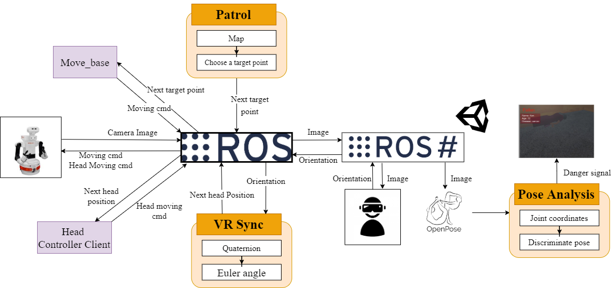

# RXR Project
The system we developed in the project work can be used for monitoring people, and taking care of the elderly or the disabled at home, nursing homes, and hospitals by letting robots frequently observe patients’ states, or conditions they are in. 
In vast facilities where the number of patients is a lot greater than the number of doctors and nurses combined, there can be patients collapsing somewhere there are no nurses around. This is when our robot comes in, they can do rounding and look for potential falling patients without being tired. This can increase rounding efficiency since nurses or doctors can be notified by the robots remotely and get to unseen falling patients faster.

See the full report [here](https://docs.google.com/document/d/11tPuoMJz6pliFUiDqYLSggAaFtuVCFRZXuk1-tJzVPQ/edit?usp=sharing)

See the demonstration [here](https://drive.google.com/file/d/1vl3pS_-th9IYGYo2_ef0UOVJPQtfjbae/view?usp=sharing)

## Functions
### Exploration
- Mapping
- Localization
- Object Avoidance
- Path Planning
### Detection
Detect possible accidents and danger. (Fallen person detection)
### VR view
The vision of the robot is provided via a VR device. The motion of the user and robot's heads are synchronized.
## Requirements
### Robot operation
- Robot: TIAGo++ by PAL Robotics
- OS: Ubuntu 18.04
- Platform: ROS
- Simulation: gazebo
- Visualization of sensor data: rviz

**NOTE:** to execute the scripts in the robot's folder, it is required to install ROS packages of Tiago++ from the link below:
http://wiki.ros.org/action/info/Robots/TIAGo%2B%2B/Tutorials
### VR
- Platform: Unity
- Human detection: Openpose_unity_plugin
- Headset orientation detection: Gyroscope
- Synchronization with robot: ROS#

**NOTE:** the pose dicrimination part is in the 'OpenPoseUserScript.cs' file and OpenPose Unity Plugin is needed to implement pose estimation. Gyro sensor data can be received by attaching the 'GyroSensor.cs' to an empty GameObject.
